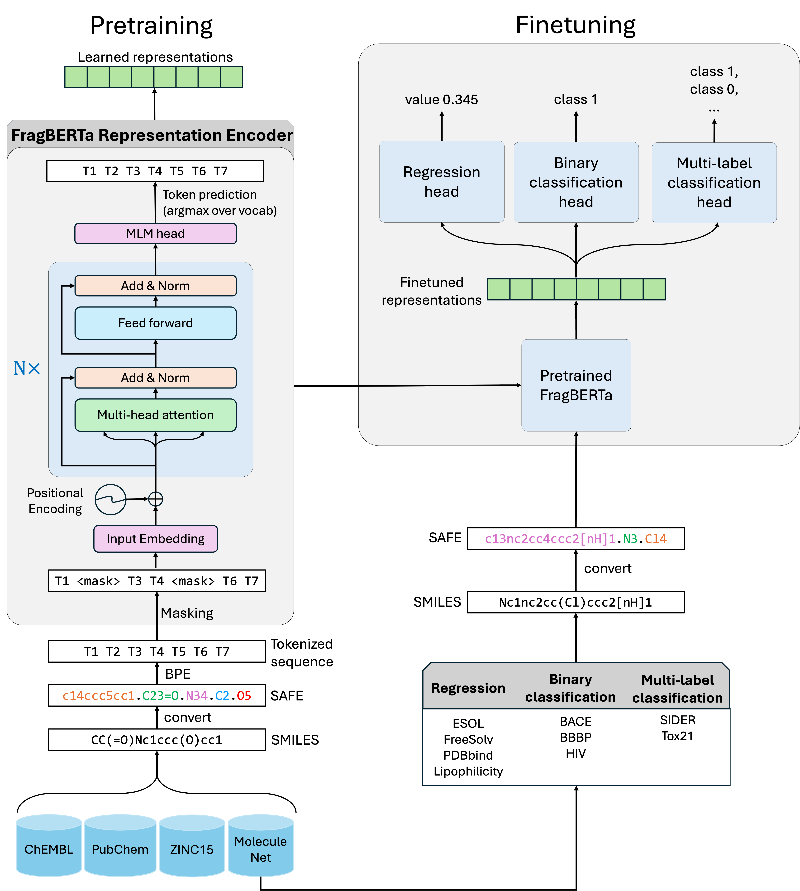

# FragBERTa: A Fragment-based Molecular Representation Learning Model with Sequential Attachment-based Fragment Embeddings

Fragment-aware transformer model using Sequential Attachement-based Fragment Encoding (SAFE) sequences for molecular representation learning and property prediction. Read the preprint here: https://chemrxiv.org/doi/full/10.26434/chemrxiv.15000476/v2

Use FragBERTa in our interactive website for inference: https://kaushallab.mtu.edu/fragberta (draft version, still in development)




### Repository Structure

- `configs/` — training configuration files  
- `data/` — pretraining, finetuning, and tokenizer data  
- `models/` — trained model checkpoints (pretrained and finetuned)
- `scripts/` — preprocessing, training, finetuning, and inference scripts  
- `notebooks/` — exploratory experiments

### Installation and environment setup

Follow these steps for setting up the environment for FragBERTa:
```bash
curl -LsSf https://astral.sh/uv/install.sh | sh #---install uv
source ~/.bashrc #---or restart terminal
git clone https://github.com/kaushal-mind-lab/FragBERTa.git #---clone repo
cd FragBERTa
uv sync
source .venv/bin/activate #---activate env
```
This reads `pyproject.toml`, creates a `.venv` folder, and installs all dependencies including PyTorch with CUDA support. No conda required.

If your cluster has a different CUDA version, edit the index URL in `pyproject.toml`:

```toml
[tool.uv.sources]
torch = { index = "pytorch-cuda" }
torchvision = { index = "pytorch-cuda" }

[[tool.uv.index]]
name = "pytorch-cuda"
url = "https://download.pytorch.org/whl/cu121"  # change to cu118 or cu130 as needed
explicit = true
```
Then re-run `uv sync`.

**Note**: If you need to install a new package, run `uv add packgae-name`. This installs the package, updates `pyproject.toml`, and regenerates `uv.lock` automatically. There is no need to run `uv sync` afterwards.


---

### Running scripts
The env must be activated before you could run any script:

```bash
# With activation
cd path/to/FragBERTa
source .venv/bin/activate
```


##### A. Pretraining
Run `python scripts/pretrain.py ` for pretraining from scratch using config file at `configs/config_pretrain.yaml`. The pretraining data should be in `parquet` format with SAFE sequnces in a column named `safe`. Note that the SAFE sequences should be prefixed by the SAFE slicing algorithm in the format `<slicer><period>` such as `BRICS.`. See the paper for more details.


##### B. Finetuning (with hyperparameter optimization)
```bash
python scripts/finetuning_with_hpopt.py \
                    --target bace \
                    --task_type slclass \
                    --use_scaffold 0 \
                    --root_dir $HOME/FragBERTa \
                    --pretrained_model_path $HOME/FragBERTa/models/pretrained \
                    --optuna_num_trials 150
```
`--target` = `esol, freesolv, lipo, pdbbind` for `task_type` = `reg`,
`--target` = `bace, bbbp, hiv` for `task_type` = `slclass`
`--target` = `tox21, sider` for `task_type` = `mlclass`

`use_scaffold` is `0` for random splits and `1` for scaffold-based splits (from Chemprop). Optuna hyperparams such as num epochs in hpopt or validation batch size can be set from inside the `finetuning_with_hpopt.py` script.

`scripts/run_all_finetuning_tasks.sh` contains a single script to run all finetuning tasks (with hyperparam optimization) in MoleculeNet datasets for both random and scaffold splits. You might want to choose some tasks at a time considering your system's CUDA memory.

`scripts/prepare_finetuning_data.py` is the shipped script to prepare finetuning data from cleaned MoleculeNet data and can be modified to prepare your own custom dataset to finetune on.

##### C. Downstream prediction on SMILES
`scripts/downstream_prediction_on_smiles.py` generates prediction of MoleculeNet targets on a custom CSV file containing molecular SMILES in a `smiles` column. It first converts SMILES to SAFE sequences with required slicer algo prefixing and then runs inference via finetuned models saved at `models/finetuned`. Run as:

```bash
python scripts/downstream_prediction_on_smiles.py \
           --target target_name \
           --model_path path/to/best_model \
           --test_data path/to/test.csv \
           --task_type task_type \
           --tokenizer_path path/to/tokenizer \
           --output_path output_filename.csv
```

An example is as follows:

```bash
python scripts/downstream_prediction_on_smiles.py \
        --target bace \
        --model_path models/finetuned/bace_on_random_split/hpopt_results/best_model/ \
        --test_data /disky/kaushal/fragberta_v2/data/interim_bace.csv \
        --task_type slclass \
        --tokenizer_path data/tokenizer/roberta_fast_tokenizer_BPE \
        --output_path tempfile.csv
```
The output CSV will contain columns named `slicer, input_smiles, canonical_smiles, safe, target, prediction`.
